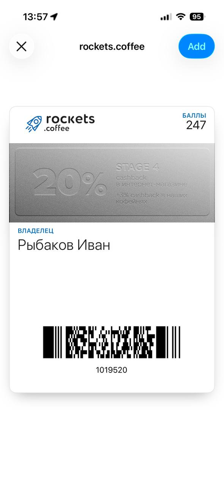

# New cards design description
New card contains front and back sides of the card. New design should use colors provided in pass.json

## Opened State
### Front
Reference for front desihn – 
#### Header (ROW)
- Card Logo in left corner
- Header Fields in right corner
#### Strip
- Card's strip image
#### Info Section
- Primary user fields
- Secondary user fields
#### Code Section
- Barcode or QRCode

### Back
#### Header (ROW)
- Card Logo in left corner
- Options button (3 dots) in right corner (opens popup with delete and share buttons)
#### Info blocks
- Card info fields structured as blocks in a column
- There is a block name at the top of the block
- Under the name is formatted HTML content with block content

## Closed State
- Card logo in a center of a Card
- Card name in plain text at the bottom of the card

## Samples
Use [temp_extract](temp_extract) to get structure of card data